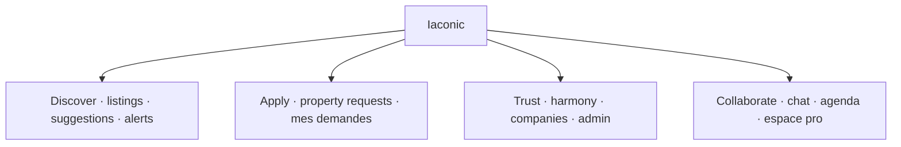
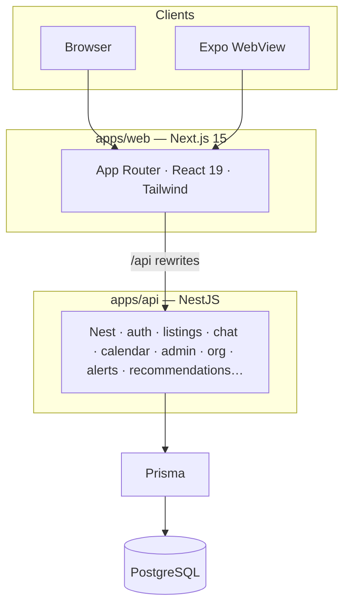
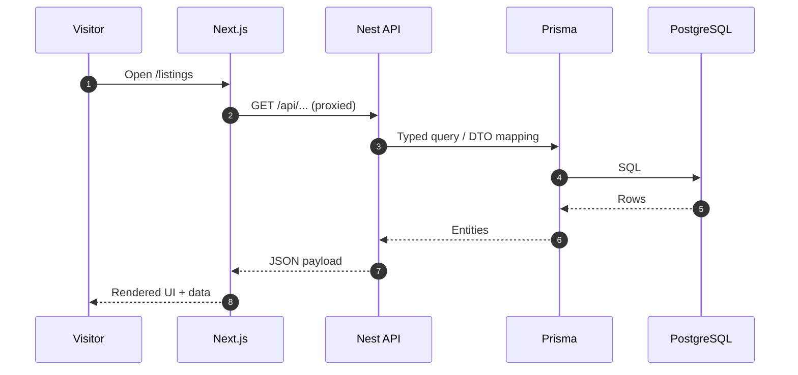

<div align="center">

```
    ╔════════════════════════════════════════════════════╗
    ║                    I A C O N I C                   ║
    ║         Rentals & flatmates · Belgian rhythm       ║
    ╚════════════════════════════════════════════════════╝
```

**One monorepo** for the full journey: discover a home, apply with context, chat with the host, align on visits, and run pro teams on the same foundation.

[](https://nodejs.org/)
[](https://www.postgresql.org/)
[](https://nextjs.org/)
[](https://nestjs.com/)
[](https://docs.docker.com/compose/)
[](https://www.typescriptlang.org/)

[Features](#features) · [Screenshots](#screenshots) · [Architecture](#architecture) · [Configuration](#configuration) · [Repository](#repository) · [Setup](#setup) · [Docker](#docker-full-stack) · [Troubleshooting](#troubleshooting) · [Playbook](./instruction.md)

</div>

---

> **In one line**  
> The **web** paints the experience. The **API** enforces the rules. **PostgreSQL** holds the truth—skip it, and every list stays blank.

---

## Quick facts

| | |
|:---|:---|
| **Shape** | Monorepo: `apps/api` (NestJS), `apps/web` (Next.js 15), `apps/mobile` (Expo WebView) |
| **Auth** | JWT, permission guards, staff/admin/company surfaces |
| **Local ports** | Postgres `50100`, API `50110`, Web `50120` (tunable in `.env`) |
| **First green path** | `npm run db:up` → `npm run db:reset` → `dev:api` + `dev:web` |

<a id="screenshots"></a>

## Screenshots

All captures below come from a **seeded** database ([`credentials.md`](./credentials.md)), **Gold (Or)** theme, **French** UI — the same experience you get after `npm run db:reset`.

| Home & discovery | Listings (annonces) |
| :--: | :--: |
| [](./docs/screenshots/01-home.png) | [](./docs/screenshots/02-listings.png) |

| Coliving & household ops | Agenda (month view) |
| :--: | :--: |
| [](./docs/screenshots/03-coliving.png) | [](./docs/screenshots/04-agenda.png) |

| Messaging | Sign-in (demo hint on page) |
| :--: | :--: |
| [](./docs/screenshots/05-chat.png) | [](./docs/screenshots/06-login.png) |

Click any thumbnail for the full-resolution PNG in the repo under [`docs/screenshots/`](./docs/screenshots/).

To **refresh** these assets after a major UI change, run the stack locally and replace the files in that folder (keeping the same names so links here stay valid).

---

<a id="features"></a>

## What you can do today

Everything below maps to **real routes** in `apps/web` today—not a roadmap slide.

<details>
<summary><strong>Marketplace & matching</strong> — listings, discovery, intent</summary>

| Capability | Routes |
|------------|--------|
| Browse and open property cards | [`/listings`](apps/web/src/app/listings/page.tsx), `/listings/[id]` |
| Publish or edit a listing | `/listings/new`, `/listings/[id]/edit` |
| Track applications you sent | [`/mes-demandes`](apps/web/src/app/mes-demandes/page.tsx) |
| Personalized suggestions | [`/suggestions`](apps/web/src/app/suggestions/page.tsx) |
| Saved search criteria & alerts | [`/alerts`](apps/web/src/app/alerts/page.tsx) |

</details>

<details>
<summary><strong>People & coliving</strong> — profiles, harmony, community entry point</summary>

| Capability | Routes |
|------------|--------|
| Coliving / flatmate discovery hub | [`/coliving`](apps/web/src/app/coliving/page.tsx) |
| Profile, themes, identity | [`/profile`](apps/web/src/app/profile/page.tsx) |
| In-app notifications | [`/notifications`](apps/web/src/app/notifications/page.tsx) |

Harmony signals and match logic are woven through API helpers and profile surfaces (see [`harmony-signals.ts`](apps/api/src/common/harmony-signals.ts)).

</details>

<details>
<summary><strong>Conversations & scheduling</strong> — chat and calendar in one flow</summary>

| Capability | Routes |
|------------|--------|
| Host / tenant messaging | [`/chat`](apps/web/src/app/chat/page.tsx) (threads in-page) |
| Visits / proposals / RSVP / ICS-style flows | [`/agenda`](apps/web/src/app/agenda/page.tsx) |

</details>

<details>
<summary><strong>Pro & org</strong> — companies, seats, broker-style teamwork</summary>

| Capability | Routes |
|------------|--------|
| Company dashboard | [`/espace-pro`](apps/web/src/app/espace-pro/page.tsx) |
| Public company profile | `/entreprise/[ownerUserId]` |
| Join a company / invite flows | [`/join-company`](apps/web/src/app/join-company/page.tsx) |
| API access token patterns (integrations) | Exposed via company / org APIs—see `company-org` in the API |

</details>

<details>
<summary><strong>Operations & trust</strong> — moderation, audits, back-office power</summary>

| Capability | Routes |
|------------|--------|
| Admin & moderation consoles | [`/admin`](apps/web/src/app/admin/page.tsx) |
| Security / audit lens | [`/admin/audit`](apps/web/src/app/admin/audit/page.tsx) |
| Company portfolio (staff) | [`/admin/companies`](apps/web/src/app/admin/companies/page.tsx), `/admin/companies/[userId]` |

</details>

<details>
<summary><strong>Access</strong></summary>

| Capability | Routes |
|------------|--------|
| Sign in / create account | [`/login`](apps/web/src/app/login/page.tsx), [`/register`](apps/web/src/app/register/page.tsx) |
| Marketing home | [`/`](apps/web/src/app/page.tsx) |

</details>

### Product map (same story, bird’s-eye)



---

<a id="architecture"></a>

## Architecture & data flow

### Layers (who talks to whom)



### Request path (happy path)



### API surface (Nest modules)

All HTTP domains live in Nest modules wired from [`app.module.ts`](apps/api/src/app.module.ts). **Prisma** is the single data access path to PostgreSQL.

| Area | Modules |
|------|---------|
| Identity & access | `AuthModule`, `UsersModule` |
| Listings & demand | `PropertiesModule`, `PropertyRequestsModule`, `AlertsModule` |
| Messaging & planning | `ChatModule`, `NotificationsModule`, `CalendarModule` |
| Org & households | `CompanyOrgModule`, `HouseholdsModule` |
| Insights & routing | `RecommendationsModule`, `NavigationModule` |
| Staff | `AdminModule` |
| Infrastructure | `PrismaModule` (shared) |

---

<a id="configuration"></a>

## Configuration & security

### Environment variables

| File | Role |
|------|------|
| [`.env.example`](./.env.example) → `.env` (repo root) | **Docker Compose**: Postgres credentials, host ports (`POSTGRES_PORT`, `API_PORT`, `WEB_PORT`), `JWT_SECRET`, `CORS_ORIGIN` for containerized API |
| [`apps/api/.env.example`](./apps/api/.env.example) → `apps/api/.env` | **Nest + Prisma**: `DATABASE_URL` (use **`127.0.0.1`** and the **same** port as root `POSTGRES_PORT` on Windows), `JWT_SECRET`, `PORT` for local API |
| `apps/web/.env.local` (optional) | **`API_PROXY_TARGET`** if the API is not on `50110` — see [`next.config.ts`](apps/web/next.config.ts) |

### Practices

- Never commit real `.env` files (they are [gitignored](./.gitignore)).
- Rotate **`JWT_SECRET`** for any shared or public deployment; the sample value is dev-only.
- [`credentials.md`](./credentials.md) lists **demo** passwords — fine for local seed data, not for production. Treat that file like a secret if your repo goes public.

### CORS & LAN

When the web app is opened from another device on the network, the API may need its **CORS** allowlist extended (`CORS_ORIGIN` in root `.env`). In dev, prefer hitting the site through Next so browser calls stay on **`/api/*`** and the rewrite hides CORS — see [`instruction.md`](./instruction.md) for LAN recipes.

---

<a id="repository"></a>

## Repository shape

```
Loyer/
├── apps/
│   ├── api/          # NestJS, Prisma, migrations, seed, business rules
│   ├── web/          # Next.js App Router — primary UX
│   └── mobile/       # Expo shell loading the same web experience
├── docker-compose.yml
├── package.json      # Orchestration scripts (db, docker, dev, build)
├── instruction.md    # Long-form playbook
└── credentials.md    # Seed demo accounts (keep private if you fork)
```

---

## Default ports

Host bindings use the **50100–50190** band so you can run other stacks in parallel.

| Service | Port | Quick check |
|---------|------|-------------|
| PostgreSQL | `50100` | `psql` / GUI against `127.0.0.1:50100` |
| Nest API | `50110` | [http://127.0.0.1:50110/api/health](http://127.0.0.1:50110/api/health) |
| Next.js | `50120` | [http://localhost:50120](http://localhost:50120) |

Tune `POSTGRES_PORT`, `API_PORT`, `WEB_PORT` in the root `.env`, then mirror the port inside `apps/api/.env` (`DATABASE_URL`, `127.0.0.1` on Windows).

---

<a id="setup"></a>

## First-time setup

<details open>
<summary><strong>Prerequisites</strong></summary>

- Node.js **20+**
- **Docker** (Postgres is the default backbone; full stack optional)
- **Git**

</details>

<details open>
<summary><strong>Recommended path — Postgres in Docker, API + Web native</strong></summary>

```bash
git clone https://github.com/takkamdarios/Loyer.git
cd Loyer
npm run install:all

cp .env.example .env
cp apps/api/.env.example apps/api/.env
# Align POSTGRES_PORT in .env with DATABASE_URL in apps/api/.env

npm run db:up
npm run db:reset

# Terminal A
npm run dev:api

# Terminal B
npm run dev:web
```

- App: [http://localhost:50120](http://localhost:50120)
- API: [http://127.0.0.1:50110/api/health](http://127.0.0.1:50110/api/health)

The web app calls **`/api/*`** on the same origin; Next rewrites to the Nest server ([`apps/web/next.config.ts`](apps/web/next.config.ts)) so you do not need ad-hoc CORS for local dev.

</details>

<a id="docker-full-stack"></a>

<details>
<summary><strong>Docker-full stack (API + Web + Postgres)</strong></summary>

```bash
cp .env.example .env
cp apps/api/.env.example apps/api/.env

npm run docker:up:api
npm run docker:seed   # mandatory once on a fresh volume
```

Stop with `npm run docker:down`.  
Prisma against the container DB: `npm run docker:prisma -- …` — spelled out in [`instruction.md`](./instruction.md).

</details>

---

## Demo logins

See [`credentials.md`](./credentials.md). Short version:

- Emails use **`@iaconic.app`** (watch the spelling: **I**aconic).
- Seed password (also echoed after seeding): **`Iaconic2026!`**
- Super-admin fixture: `anne-lise@iaconic.app`

---

## Root scripts

| Command | Purpose |
|---------|---------|
| `npm run db:up` / `db:down` | Postgres container lifecycle |
| `npm run db:reset` | Migrate + seed via `apps/api` |
| `npm run docker:up:api` | Build & run full Compose profile |
| `npm run docker:seed` | Seed the database your containers see |
| `npm run docker:prisma -- <cmd>` | Prisma inside Compose |
| `npm run build` | Production builds (API + Web) |
| `npm run clean:web` | Nuke `.next` when Windows HMR/cache acts up |

---

## Mobile (`apps/mobile`)

The Expo project is a **thin shell**: it loads the same Next experience in a **WebView**, so you can smoke-test flows on a device without duplicating screens. Install deps with `npm run install:all`, then `npm run dev:mobile`. Point the WebView base URL at your LAN IP / port when testing off localhost (mirrors the LAN notes in [`instruction.md`](./instruction.md)).

---

## Testing & quality

| Scope | Command |
|-------|---------|
| API unit / e2e | `npm test --prefix apps/api` (see [`apps/api/package.json`](apps/api/package.json) for scripts) |
| Production compile check | `npm run build` at the monorepo root |

---

## Docker images & static assets

For **Dockerized** web builds, remote images may require `NEXT_IMAGE_UNOPTIMIZED=1` so Next serves originals without the optimizer blocking external URLs — see comments in [`apps/web/next.config.ts`](apps/web/next.config.ts) and Compose env for the web service.

---

<a id="troubleshooting"></a>

## Troubleshooting

| Symptom | Try |
|---------|-----|
| Flat / unstyled page | One `next dev` only → `npm run clean:web` → hard reload |
| `ChunkLoadError` | Close stale tabs; ensure you are on port `50120` |
| Empty listings in Docker | `npm run docker:seed` (container DB ≠ host DB) |
| Login always fails | Use `@iaconic.app` + password from [`credentials.md`](./credentials.md) |
| Port clash | Shift `.env` ports + `DATABASE_URL` together |

---

## Further reading

| Doc | Why open it |
|-----|-------------|
| [`instruction.md`](./instruction.md) | LAN testing, Prisma edge cases, long checklist |
| [`credentials.md`](./credentials.md) | All seeded personas & passwords |

---

<div align="center">

**Iaconic** — *the right nest, at the right rent.*

</div>
